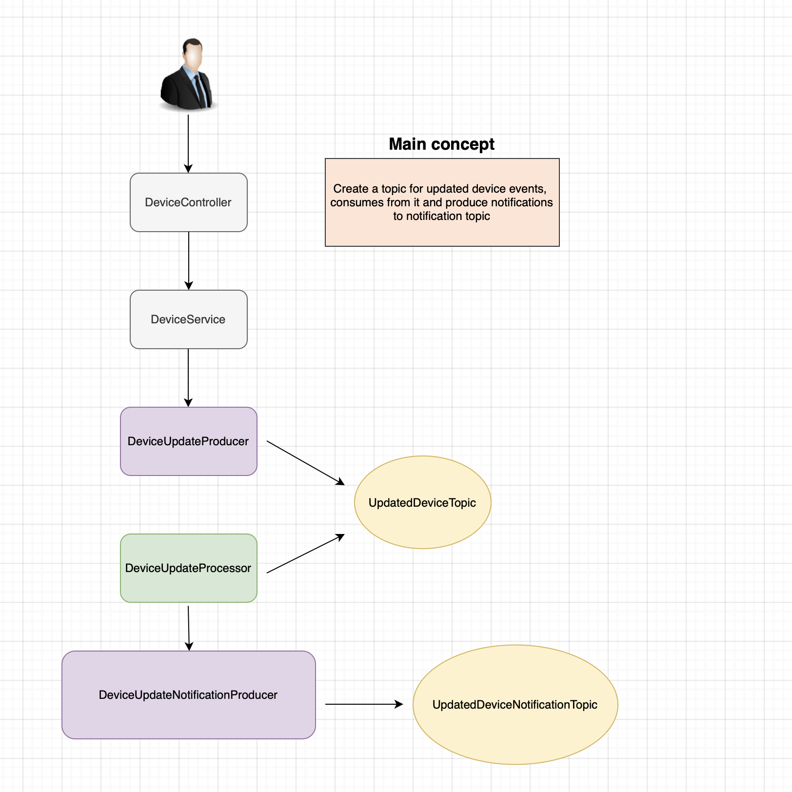

#  __**Iot-Management-Device**__ 
The application has been designed to enhance the management and monitoring of IoT devices. Its functionalities include:

* ***Device Management***:

Adding new IoT devices to the network.

Removing outdated or non-functional devices.

Updating the status of connected devices.

Automatically notifying users when there are changes to the status of their devices.

+ ***User Management***:

Registering new users within the system.

Associating each user with specific IoT devices they own or manage.

Allowing users to view and control their assigned devices.

Sending notifications to users regarding updates to their device status.

Ensuring users are informed in real-time about any changes that might require their attention.

## Kafka Diagram

### Core Technologies:
* ***Kotlin***
* ***Gradle***
### Spring Framework:
* ***Spring Boot***
* ***Spring Data JPA***
* ***Spring Boot Validation***
* ***Spring Boot Docker***
### Database and Persistence:
* ***Mongo***
* ***Hibernate***
* ***Liquibase***
### Auxiliary Libraries:
* ***Lombok***
* ***MapStruct***